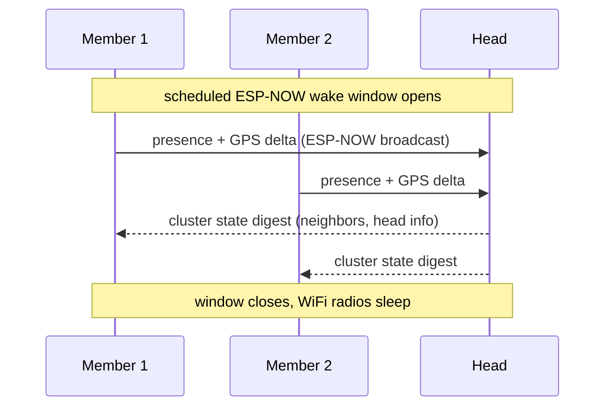
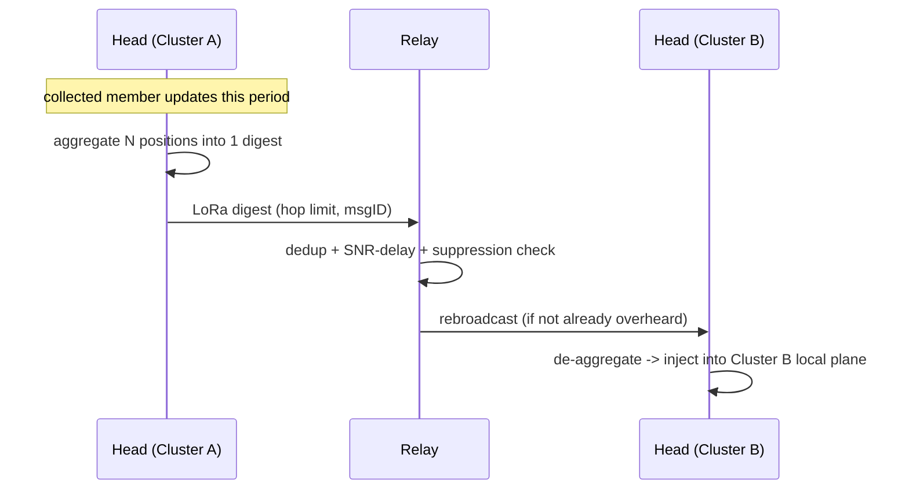

# 04 — Architecture

The proposal. Opinionated, but every choice is tied to a constraint from
[02](02-hardware-and-rf-platform.md) and re-examined empirically in the POCs.

## The two planes

```
            ┌──────────────────────── LONG-RANGE PLANE (LR1121, sub-GHz) ────────────────────────┐
            │  cheap to listen (~6 mA) · expensive to talk (~90 mA) · low rate · km range          │
            │  carries: presence digests, GPS digests, text, relay traffic, store-and-forward      │
            │  discipline: managed flood + hop limit + suppression + duty-cycle budget             │
            └───────▲───────────────────────────▲───────────────────────────▲────────────────────┘
                    │ bridge                     │ bridge                     │ bridge
            ┌───────┴────────┐          ┌────────┴───────┐          ┌─────────┴──────┐
            │   CLUSTER A    │          │   CLUSTER B    │          │   CLUSTER C    │
            │  ESP-NOW 2.4   │          │  ESP-NOW 2.4   │          │  ESP-NOW 2.4   │
            │  fast burst    │          │  fast burst    │          │  fast burst    │
            │  M M M (Head)  │          │  M (Head) M    │          │  M M (Head)    │
            └────────────────┘          └────────────────┘          └────────────────┘
              LOCAL PLANE                 LOCAL PLANE                  LOCAL PLANE
```

- **Local plane (LP):** ESP-NOW over the C3's 2.4 GHz radio. Connectionless,
  ≤250 B frames (v1), ~1 Mbps. Used inside a cluster for discovery, fast state
  sync, intra-cluster messaging, and *aggregation*. Used in **scheduled bursts**
  (it's power-expensive to keep in RX).
- **Long-range plane (LRP):** LR1121 sub-GHz LoRa. Cheap to keep in RX, costly
  to TX. Used **between** clusters and to sparse/lone nodes: presence/GPS
  digests, text, relayed traffic, store-and-forward. TX is rationed by a duty
  budget and only **cluster heads/relays** transmit.

The defining rule: **chatter stays local; only digests and selected traffic
cross the long-range plane.**

## Why this split (the power asymmetry)

| | LoRa RX | WiFi RX |
|---|---|---|
| Current | ~6 mA | ~95 mA |
| Implication | can listen ~continuously for days | must be bursted |

So LoRa is the **always-on control/wake plane** and ESP-NOW is the **on-demand
burst plane**. A node can sit in LoRa RX sipping ~6 mA, hear a "sync window
opening" cue, briefly wake its WiFi radio for a fast ESP-NOW exchange, then drop
WiFi again. See the super-frame below.

## Node roles (soft, negotiated, hysteresis-damped)

Roles are **not** fixed hardware classes; any node can take any role and they
rotate. Hysteresis prevents election thrash under mobility.

| Role | Does | Power posture |
|------|------|---------------|
| **Member (M)** | participates in LP; listens on LRP; no LRP TX | lowest; LoRa RX + bursty WiFi |
| **Cluster Head (H)** | elected per cluster; owns the LRP duty budget; aggregates cluster state → LoRa digest; de-aggregates inbound LoRa → LP | higher (LRP TX); rotates to share burden |
| **Relay (R)** | forwards LRP traffic between clusters under suppression rules | higher; only when topology needs it |
| **Gateway (GW)** | *ephemeral*: a node a phone connects to (BLE) to read/inject | transient; any node, briefly |

Election inputs (computed locally, advertised in beacons):
`score = w1·battery + w2·local_centrality + w3·link_quality + w4·role_stability`
Highest score in a cluster becomes Head; ties broken by NodeID. Hysteresis: a
challenger must beat the incumbent by a margin for K consecutive windows.

## Addressing & identity

- **NodeID:** 32-bit, derived from the C3 MAC / a provisioned key. Globally
  unique-enough; the on-air *short address* is the low 16 bits within a cluster
  (collisions resolved at join).
- **ClusterID:** 16-bit, derived from the current Head's NodeID (so it changes
  on re-election; members learn it from beacons).
- **MessageID:** `(originator NodeID, 16-bit seq)` → the dedup key everywhere.
- **GroupID (optional):** a shared 16-bit tag so multiple logical groups can
  share spectrum without merging traffic.

No IP, no DHCP, no routing tables on the LRP. Identity is flat; structure is
emergent (clusters) and soft.

## The crux: what crosses the long-range plane

This decision logic is the whole value proposition. A Head deciding whether to
spend LRP airtime on a piece of information:

```
on local update U from the cluster:
  if U is purely intra-cluster (e.g. fine-grained position to a neighbor):
      -> stay local, never bridge
  else classify U:
      presence/GPS  -> AGGREGATE into the periodic cluster digest (do not send now)
      text/event    -> bridge now, but DEDUP and rate-limit per originator
      telemetry     -> SAMPLE/decimate to the configured rate, then aggregate
  before any LRP TX:
      if duty-budget exhausted this hour -> queue (store-and-forward)
      if already overheard from another Head/Relay -> SUPPRESS
      apply hop limit; apply SNR-proportional rebroadcast delay
```

Three levers do the heavy lifting:
1. **Aggregate** — N members' positions → one digest frame (airtime ∝ clusters,
   not ∝ nodes). This is the scalability win; quantified in
   [08](08-mobility-and-topology.md).
2. **Suppress** — overhear-based: if you hear the message already relayed with
   an equal/better hop count, don't repeat it.
3. **Ration** — a per-hour duty budget per node (and regulatory sub-band duty
   limits), with store-and-forward for overflow.

## Mesh strategy per plane

- **Local plane:** small diameter, high churn → **flooding with dedup +
  overhear suppression**, no routing tables. Within a cluster of a handful of
  hops this is cheapest and most robust. (We measure the crossover where this
  breaks in [08](08-mobility-and-topology.md).)
- **Long-range plane:** **managed flood** (Meshtastic-style) over *aggregated*
  traffic only: hop limit, dedup, SNR-proportional rebroadcast delay, relay
  election. No proactive routing — link state is too expensive on a slow,
  churny channel.
- **Across partitions:** **DTN bundle-lite** overlay — hold-and-forward with
  summary-vector dedup; a mobile node carries bundles between islands.

## Communication flows

### Flow 1 — local discovery & sync (intra-cluster)



### Flow 2 — bridge a cluster to the world (aggregate → LoRa)



### Flow 3 — store-and-forward across a partition (mule)

```mermaid
sequenceDiagram
    participant A as Island A node
    participant Mule as Moving node
    participant B as Island B node
    A->>Mule: bundle (text, msgID) over LoRa when in range
    Note over Mule: out of range of everyone; holds bundle
    Mule->>B: later, in range of B: offer summary vector
    B-->>Mule: request missing msgIDs
    Mule->>B: deliver bundle
```

### Flow 4 — ephemeral phone gateway

```mermaid
sequenceDiagram
    participant Phone
    participant GW as Node (becomes Gateway)
    Phone->>GW: BLE connect (on user action / button)
    GW-->>Phone: snapshot: neighbors, positions, recent messages
    Phone->>GW: inject message / config change
    GW->>GW: schedule onto local + (if needed) long-range plane
    Phone->>GW: BLE disconnect
    Note over GW: reverts to Member; 2.4 GHz radio back to ESP-NOW schedule
```

## The super-frame (time as a shared resource)

The C3 has **one** 2.4 GHz radio shared by WiFi (ESP-NOW) and BLE, and the
optional LR1121 2.4 GHz mode would contend too. We schedule time into a repeating
super-frame so the radios never fight:

```
|<-------------------------- super-frame (e.g. 1–10 s) -------------------------->|
| LoRa RX (always)  ............................................................. |  (sub-GHz, runs in parallel, cheap)
| [ESP-NOW sync window] [quiet / sleep] [BLE gateway slot?] [LoRa TX slot?] ...... |  (2.4 GHz + LRP TX, mutually exclusive)
```

- **LoRa sub-GHz RX runs continuously** in the background (different band, cheap)
  — it's the wake/control channel.
- The **2.4 GHz medium is time-divided**: a short ESP-NOW sync window, then
  sleep, with optional BLE-gateway and (if used) 2.4-LoRa slots that never
  overlap WiFi.
- **LRP TX** is scheduled into its own slot and bounded by the duty budget.
- Members align their wake windows to the Head's beacon schedule, so the
  expensive WiFi radio is on only briefly and *together*.

Details and the coexistence rationale: [06](06-rf-coexistence.md). Timing/airtime
math: [05](05-protocol.md) and [07](07-power-and-runtime.md).

## What we explicitly avoid

- No proactive/link-state routing on the LRP.
- No always-on WiFi or always-on relay nodes.
- No fixed gateways/infrastructure; gateways are ephemeral.
- No global time master required (loose sync via Head beacons; tolerate drift).
- No assumption that mesh helps — every plane's strategy has a measured regime
  where it's the right choice ([08](08-mobility-and-topology.md)).
