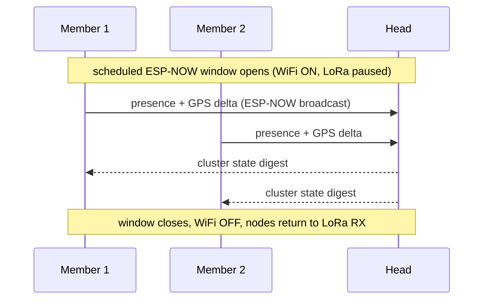
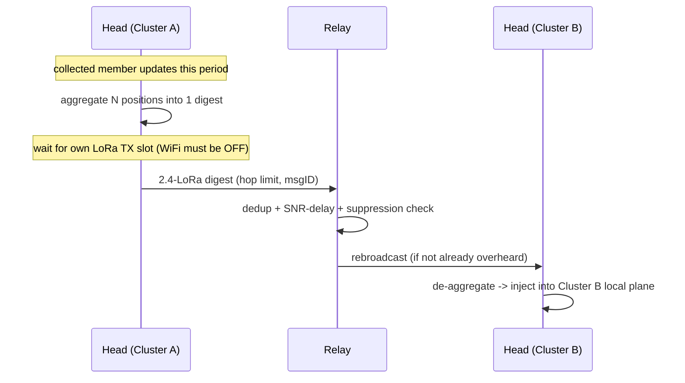

# 04 — Architecture (single-band 2.4 GHz)

The proposal, re-centered on **one 2.4 GHz band, two radios, time-shared**.
Every choice ties to a constraint from [02](02-hardware-and-rf-platform.md) and
is re-examined empirically in the POCs.

## The two planes (same band, different radios)

```
            ┌────────────── LONG-RANGE PLANE (LR1121, 2.4 GHz LoRa) ──────────────┐
            │  cheap to listen (~6 mA) · costs ~50 mA to talk · low rate · 100s m–~km │
            │  carries: presence/GPS digests, text, relay traffic, store-and-forward  │
            │  discipline: managed flood + hop limit + suppression + airtime budget   │
            └───────▲───────────────────────▲───────────────────────▲───────────────┘
                    │ bridge                 │ bridge                 │ bridge
            ┌───────┴────────┐      ┌────────┴───────┐      ┌─────────┴──────┐
            │   CLUSTER A    │      │   CLUSTER B    │      │   CLUSTER C    │
            │  ESP-NOW 2.4   │      │  ESP-NOW 2.4   │      │  ESP-NOW 2.4   │
            │  fast burst    │      │  fast burst    │      │  fast burst    │
            │  M M M (Head)  │      │  M (Head) M    │      │  M M (Head)    │
            └────────────────┘      └────────────────┘      └────────────────┘
              LOCAL PLANE             LOCAL PLANE              LOCAL PLANE

  *** Both planes are 2.4 GHz on the same board → they NEVER transmit at once. ***
  *** Time-division (the super-frame) is mandatory, not optional. ***
```

- **Local plane (LP):** ESP-NOW over the C3's WiFi radio (2.4 GHz). Connectionless,
  ≤250 B frames (v1), ~1 Mbps. Used inside a cluster for discovery, fast state
  sync, intra-cluster messaging, and *aggregation*. Used in **scheduled bursts**
  (WiFi RX is power-expensive).
- **Long-range plane (LRP):** LR1121 **2.4 GHz LoRa**. Cheap to keep in RX
  (~6 mA), modest to TX (~50 mA at +13 dBm). Range is set by SF/BW (hundreds of
  metres to ~km with the integrated antenna). Used **between** clusters and to
  sparse/lone nodes; only **cluster heads/relays** transmit.

The defining rule is unchanged from the dual-band concept: **chatter stays
local; only digests and selected traffic cross the long-range plane.** What
changes is that the two planes now compete for the *same band*, so the schedule
is king.

## Why this split still works on one band (the power asymmetry)

| | LR1121 2.4 LoRa RX | C3 WiFi RX |
|---|---|---|
| Current | ~6 mA | ~95 mA |
| Implication | listen ~continuously for days | must be bursted |

So LoRa-2.4 is the **always-on control/wake plane** and ESP-NOW is the
**on-demand burst plane**. A node sits in LoRa RX sipping ~6 mA, hears a "sync
window opening" cue, briefly wakes WiFi for a fast ESP-NOW exchange, then drops
WiFi. The asymmetry that justified the architecture is a property of the
*radios*, not the *bands*, so it survives single-band.

## The super-frame (now the heart of the design)

With both planes in 2.4 GHz, time is the scarce resource. A repeating super-frame
guarantees the two radios never transmit simultaneously and bounds each plane's
airtime.

```
|<------------------------------ super-frame (e.g. 250 ms – 2 s) ----------------------------->|
LR1121 2.4 LoRa RX : ████████░░░░░░░░░░░░░░░░░░░░░░░░░░░░░░░████████  (listen when WiFi is OFF)
2.4 GHz medium     : [ LoRa RX ][ ESP-NOW window ][ sleep ][ LoRa TX slot ][ BLE GW? ] ........
                       ^cheap     ^WiFi ON, ~95 mA  ^idle    ^Head/Relay     ^only if phone
```

Rules enforced by the schedule:
- **Exactly one radio uses the 2.4 GHz medium at a time.** LoRa RX, ESP-NOW
  window, LoRa TX, and BLE-gateway slots are mutually exclusive.
- **LoRa RX fills the gaps** (it's the cheap default state) so a node is reachable
  on the LRP whenever it isn't doing an ESP-NOW burst or a LoRa TX.
- **ESP-NOW windows are short and aligned** to the Head's beacon so members wake
  WiFi together, briefly.
- **LoRa TX is Head/Relay-only**, scheduled, and airtime-budgeted.
- **Guard intervals** absorb clock drift between nodes (sized in Phase 7).

This is a tighter constraint than the original dual-band plan, where sub-GHz RX
could run in parallel with 2.4 GHz WiFi. Here, *every* radio action is a slot.
Coexistence rationale and measurements: [06](06-rf-coexistence.md).

## Node roles (soft, negotiated, hysteresis-damped)

Roles are not fixed hardware classes; any node can take any role and they rotate.
Hysteresis prevents election thrash under mobility.

| Role | Does | Power posture |
|------|------|---------------|
| **Member (M)** | participates in LP; listens on LRP; no LRP TX | lowest; LoRa RX + bursty WiFi |
| **Cluster Head (H)** | elected per cluster; owns the LRP airtime budget; aggregates cluster state → LoRa digest; de-aggregates inbound LoRa → LP | higher (LRP TX); rotates |
| **Relay (R)** | forwards LRP traffic between clusters under suppression rules | higher; only when topology needs it |
| **Gateway (GW)** | *ephemeral*: a node a phone connects to (BLE) to read/inject | transient; any node, briefly |

Election inputs (computed locally, advertised in beacons):
`score = w1·battery + w2·local_centrality + w3·link_quality + w4·role_stability`.
Highest score in a cluster becomes Head; ties broken by NodeID. Hysteresis: a
challenger must beat the incumbent by a margin for K consecutive windows.

## Addressing & identity

- **NodeID:** 32-bit, from the C3 MAC / a provisioned key.
- **ShortAddr:** low 16 bits, used within a cluster (collisions resolved at join).
- **ClusterID:** 16-bit, derived from the current Head's NodeID (changes on
  re-election; members learn it from beacons).
- **MessageID:** `(originator NodeID, 16-bit seq)` → the dedup key everywhere.
- **GroupID (optional):** a shared 16-bit tag so multiple logical groups share
  spectrum without merging traffic.

No IP, no routing tables on the LRP. Identity is flat; structure (clusters) is
emergent and soft.

## The crux: what crosses the long-range plane

The whole value proposition. A Head deciding whether to spend LRP airtime:

```
on local update U from the cluster:
  if U is purely intra-cluster (e.g. fine-grained position to a neighbor):
      -> stay local, never bridge
  else classify U:
      presence/GPS  -> AGGREGATE into the periodic cluster digest (don't send now)
      text/event    -> bridge now, but DEDUP and rate-limit per originator
      telemetry     -> SAMPLE/decimate to the configured rate, then aggregate
  before any LRP TX:
      if this super-frame's LoRa TX slot is taken / budget spent -> queue (S&F)
      if already overheard from another Head/Relay -> SUPPRESS
      apply hop limit; apply SNR-proportional rebroadcast delay
```

Three levers do the heavy lifting:
1. **Aggregate** — N members' positions → one digest frame (airtime ∝ clusters,
   not ∝ nodes). The scalability win; quantified in [08](08-mobility-and-topology.md).
2. **Suppress** — overhear-based: don't repeat what's already been relayed.
3. **Ration** — a per-node airtime budget *and* the super-frame's single LoRa TX
   slot, with store-and-forward for overflow.

## Mesh strategy per plane

- **Local plane:** small diameter, high churn → **flooding with dedup + overhear
  suppression**, no routing tables.
- **Long-range plane:** **managed flood** over *aggregated* traffic only: hop
  limit, dedup, SNR-proportional rebroadcast delay, relay election. No proactive
  routing — link state is too costly on a slow, churny LoRa channel.
- **Across partitions:** **DTN bundle-lite** — hold-and-forward with summary-
  vector dedup; a mobile node carries bundles between islands.

## Communication flows

### Flow 1 — local discovery & sync (intra-cluster, ESP-NOW window)



### Flow 2 — bridge a cluster to the world (aggregate → 2.4-LoRa)



### Flow 3 — store-and-forward across a partition (mule)

```mermaid
sequenceDiagram
    participant A as Island A node
    participant Mule as Moving node
    participant B as Island B node
    A->>Mule: bundle (text, msgID) over 2.4-LoRa when in range
    Note over Mule: out of range of everyone; holds bundle
    Mule->>B: later, in range of B: offer summary vector
    B-->>Mule: request missing msgIDs
    Mule->>B: deliver bundle
```

### Flow 4 — ephemeral phone gateway

```mermaid
sequenceDiagram
    participant Phone
    participant GW as Node (becomes Gateway)
    Phone->>GW: BLE connect (on user action / button)
    Note over GW: BLE takes the 2.4 GHz medium; LoRa + ESP-NOW paused
    GW-->>Phone: snapshot: neighbors, positions, recent messages
    Phone->>GW: inject message / config change
    GW->>GW: schedule onto local + (if needed) long-range plane
    Phone->>GW: BLE disconnect
    Note over GW: reverts to Member; resumes the super-frame
```

The gateway speaks the **Meshtastic BLE client protocol**, so an unmodified
Meshtastic phone app can connect and see the node as a Meshtastic device — we
reuse their app as our UI instead of building one. This is a compatibility shim
at the gateway only; our planes stay ours. Full design: [11 — Mobile Gateway](11-mobile-gateway-meshtastic-compat.md).

## What we explicitly avoid

- No proactive/link-state routing on the LRP.
- No always-on WiFi or always-on relay nodes.
- No fixed gateways/infrastructure; gateways are ephemeral.
- No global time master (loose sync via Head beacons; guard intervals absorb drift).
- No simultaneous 2.4 GHz transmissions — the schedule forbids it.
- No assumption that mesh helps — every plane's strategy has a measured regime
  where it's the right choice ([08](08-mobility-and-topology.md)).
